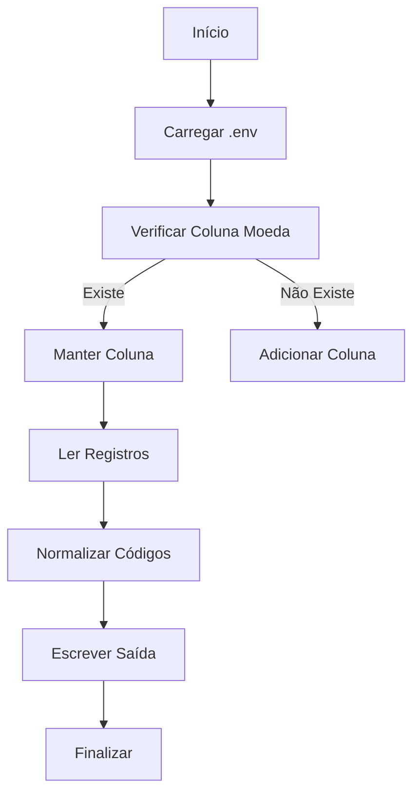

# 📋 Processador de CSV para Normalização de Moedas

Ferramenta em Go para normalização de códigos de moeda em arquivos CSV utilizando mapeamento personalizado.


## ✨ Funcionalidades
- **Detecção Automática**: Identifica colunas de moeda ("currency" ou "moeda")
- **Normalização ISO**: Converte para códigos padrão de 3 letras (USD, EUR, etc.)
- **Fallback Seguro**: Usa "BRL" para valores desconhecidos
- **Gerenciamento de Colunas**: Adiciona coluna "currency" se necessário
- **Configuração Flexível**: Parâmetros via arquivo `.env`

## ⚡ Pré-requisitos
- Go 1.16+
- Arquivo CSV com dados financeiros
- Pacote de mapeamento: `github.com/samuelrms/translate-currency`

## 🛠 Instalação
```bash
git clone https://github.com/samuelrms/currency-processor.git
cd currency-processor
go get github.com/samuelrms/translate-currency
go build -o processor
```

## 🔧 Configuração (.env)
```ini
INPUT_NAME="dados.csv"    # Nome do arquivo de entrada
OUTPUT_NAME="processed.csv" # Nome do arquivo de saída
```

## 🚀 Uso Básico
```bash
# Processar com padrões (docs/dados.csv → data/processed.csv)
./processor

# Customizar entrada/saída
export INPUT_NAME="transacoes.csv"
export OUTPUT_NAME="resultado.csv"
./processor
```

## 🔄 Fluxo de Processamento


## 📌 Exemplo Prático
**Entrada (docs/dados.csv)**:
```csv
id,valor,moeda
1,150,reais
2,200,US dollars
3,300,euros
```

**Saída (data/processed.csv)**:
```csv
id,valor,moeda
1,150,BRL
2,200,USD
3,300,EUR
```

## 🛑 Tratamento de Erros Comuns
**Arquivo Não Encontrado**  
```log
Error opening docs/dados.csv: no such file or directory
```
- Verifique se o arquivo existe na pasta `docs/`
- Confira o nome no `.env`

**Problema de Permissão**  
```log
Could not create directory data: permission denied
```
- Execute com `sudo` (Linux/Mac)
- Libere permissões na pasta

**Mapeamento Desconhecido**  
```log
Valor "YEN" mapeado para BRL (padrão)
```
- Adicione entrada no `CurrencyMap` do pacote

## 🔄 Personalização
**1. Adicionar Novas Moedas**  
Modifique o mapeamento no pacote:
```go
// currency_map/currency_map.go
var CurrencyMap = map[string]string{
    ...
    "YEN":        "JPY", // Novo mapeamento
    "DÓLAR":      "USD",
}
```

**2. Alterar Coluna Padrão**  
Modifique os identificadores de busca:
```go
// main.go
if c == "currency" || c == "moeda" || c == "tipo_moeda" {
```

**3. Mudar Fallback**  
Altere o código padrão para casos não mapeados:
```go
rec[currencyIdx] = "USD" // Antes era BRL
```

## 📄 Licença
MIT License - Consulte [LICENSE](LICENSE) para detalhes.

---

**Otimizações**:  
- Processa arquivos grandes eficientemente
- Suporte a múltiplos formatos de entrada
- Fácil integração com pipelines de dados

**Nota**: Para atualizar o mapeamento, recomepile após modificar o pacote `currency_map`.