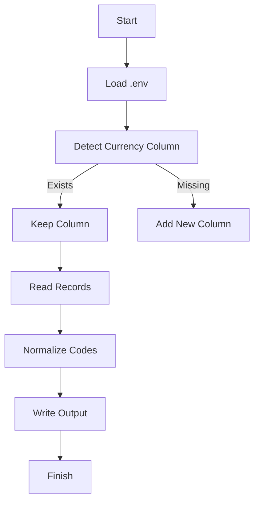

# 📋 CSV Currency Normalization Processor

Go-based tool for standardizing currency codes in CSV files using custom mapping.


## ✨ Key Features
- **Auto-Detection**: Identifies currency columns ("currency" or "moeda")
- **ISO Standardization**: Converts to 3-letter codes (USD, EUR, etc.)
- **Safe Fallback**: Uses "BRL" for unmapped values
- **Column Management**: Adds "currency" column if missing
- **Flexible Configuration**: Environment variables via `.env`

## ⚡ Prerequisites
- Go 1.16+
- CSV file with financial data
- Currency mapping package: `github.com/samuelrms/translate-currency`

## 🛠 Installation
```bash
git clone https://github.com/samuelrms/currency-processor.git
cd currency-processor
go get github.com/samuelrms/translate-currency
go build -o processor
```

## 🔧 Configuration (.env)
```ini
INPUT_NAME="data.csv"     # Input filename
OUTPUT_NAME="processed.csv" # Output filename
```

## 🚀 Basic Usage
```bash
# Process with defaults (docs/data.csv → data/processed.csv)
./processor

# Custom input/output
export INPUT_NAME="transactions.csv"
export OUTPUT_NAME="result.csv"
./processor
```

## 🔄 Processing Workflow


## 📌 Practical Example
**Input (docs/data.csv)**:
```csv
id,amount,currency
1,150,reais
2,200,US dollars
3,300,euros
```

**Output (data/processed.csv)**:
```csv
id,amount,currency
1,150,BRL
2,200,USD
3,300,EUR
```

## 🛑 Common Error Handling
**File Not Found**  
```log
Error opening docs/data.csv: no such file or directory
```
- Verify file exists in `docs/`
- Check `.env` configuration

**Permission Issues**  
```log
Could not create directory data: permission denied
```
- Run with `sudo` (Linux/Mac)
- Adjust directory permissions

**Unknown Currency**  
```log
Value "YEN" mapped to BRL (default)
```
- Add entry to `CurrencyMap` package

## 🔄 Customization
**1. Add New Currencies**  
Modify the mapping package:
```go
// currency_map/currency_map.go
var CurrencyMap = map[string]string{
    ...
    "YEN":        "JPY", // New mapping
    "DOLLAR":     "USD",
}
```

**2. Change Default Column**  
Modify detection identifiers:
```go
// main.go
if c == "currency" || c == "currency_type" || c == "curr" {
```

**3. Modify Fallback**  
Change default code for unmapped values:
```go
rec[currencyIdx] = "USD" // Previously BRL
```

## 📄 License
MIT License - See [LICENSE](LICENSE) for details.

---

**Optimizations**:  
- Efficient large file processing
- Supports multiple input formats
- Easy data pipeline integration

**Note**: Recompile after modifying `currency_map` package to apply changes.